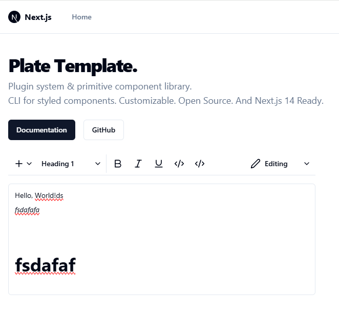

# Playground Template

A minimal template for building rich-text editors with [Plate](https://platejs.org/) and Next.js 14.

## Usage

```bash
pnpm install
pnpm dev
```

## Features

- Next.js 14 App Directory
- [Plate](https://platejs.org/) Editor
- [shadcn/ui](https://ui.shadcn.com/)
- Radix UI Primitives
- Tailwind CSS
- Icons from [Lucide](https://lucide.dev)
- Dark mode with `next-themes`
- Tailwind CSS class sorting, merging and linting.


### ProductivityTools comment 
I tried to run the plate from the template. The last version is working and displays page as below. 


